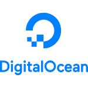

##  **Github Stats**

##  **Infrastructures**

##  **Coding**

##  **Connect With Me**

- [GitHub](https://github.com/genesisbertiz)
- [LinkedIn](https://linkedin.com/in/genesisbertiz)
- [Portfolio](https://genesisbertiz.vercel.app)

#

<a href="https://www.flaticon.com/free-animated-icons/illustration" title="illustration animated icons">Illustration animated icons created by Freepik - Flaticon</a>
